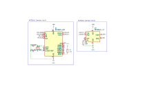

# CAN Interface Template

All Micro controllers will be required to use the MCP2551 CAN transiever to connect to the differential signalling of CAN bus.

Micro controllers without inbuilt CAN interface will also need to use the MCP2515 to connect to the transiever over SPI. The picro controller will connect to SPI over the pins `SPI_MOSI`, `SPI_MISO`, `SPI_CS`, `SPI_SCK`. And the MCP2515 will need to be connected to the transiever by connecting the two `RXCAN`, and `TXCAN`, lines respectively.
